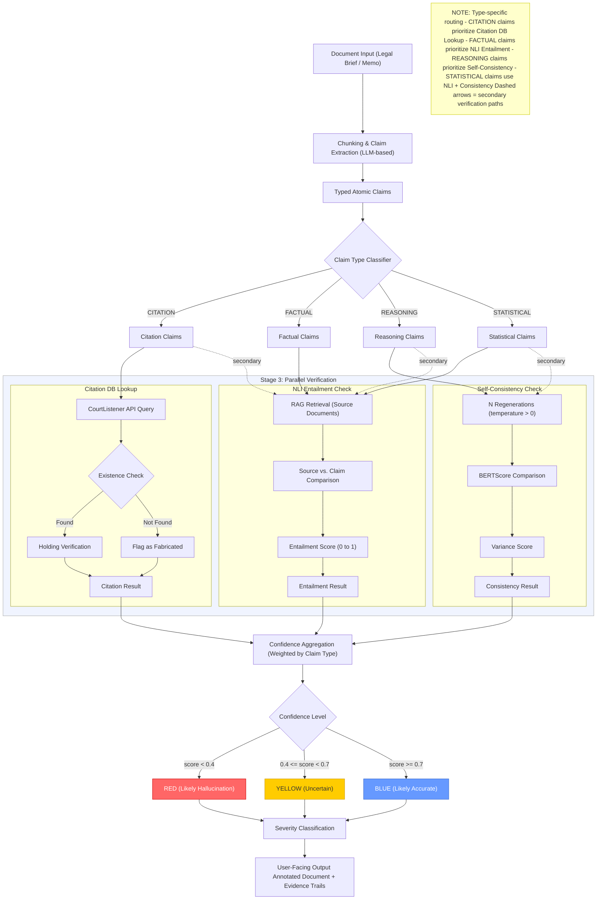

# Architecture Overview — Multi-Stage Claim Verification Pipeline

The following diagram illustrates the end-to-end architecture of the hallucination detection system. A legal document enters the pipeline, is decomposed into typed atomic claims, and each claim is routed through parallel verification strategies selected by claim type. Results are aggregated into a weighted confidence score and surfaced to the user with full evidence trails.

