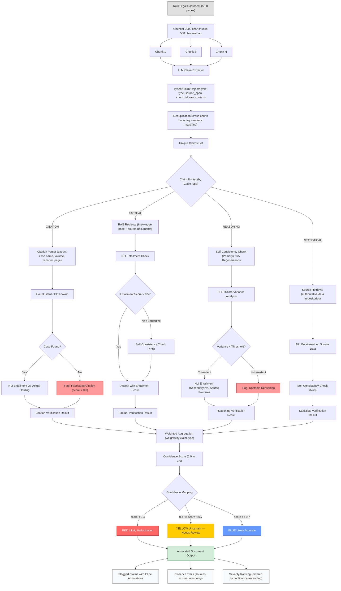

# Detection Pipeline — Detailed Data Flow

The following diagram traces the complete data flow from raw legal document input through claim extraction, type-based routing, verification, and final annotated output. Each claim type follows a purpose-built verification path with primary and secondary checks. Confidence scores are mapped to a three-tier system: RED (likely hallucination), YELLOW (uncertain), and BLUE (likely accurate).

