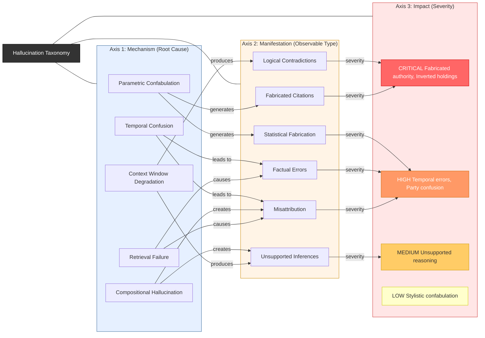

# Hallucination Taxonomy — Three-Axis Classification

The following diagram presents a three-axis taxonomy for classifying hallucinations in legal AI writing. Each hallucination is characterized along three independent dimensions: the underlying **mechanism** (root cause), the observable **manifestation** (what the user sees), and the **impact** (severity in a legal context). Connections between axes show the most common causal relationships, illustrating how specific root causes tend to produce particular observable patterns and severity levels.

